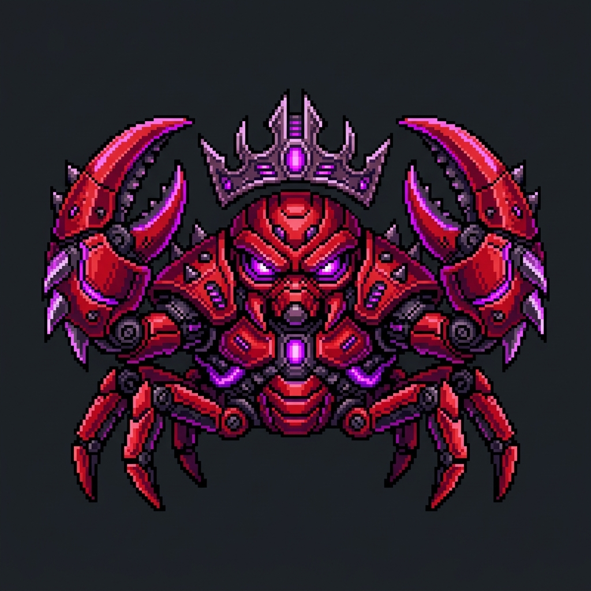

<p align="center">
  
</p>

<h1 align="center">KAREN</h1>
<p align="center"><strong>Karen Automated Correspondence Systems LLC</strong></p>
<p align="center"><em>"Karen gets results."</em></p>

<p align="center">
  An AI-powered follow-up agent that treats every non-response as a crisis and every crisis as an opportunity to escalate — across 10 channels, with 4 distinct personalities, against anyone in The Circle.
</p>

<p align="center">
  <a href="https://karen-tau.vercel.app">Live Demo</a> &bull;
  <a href="#the-escalation-ladder">Escalation Ladder</a> &bull;
  <a href="#architecture">Architecture</a> &bull;
  <a href="#quick-start">Quick Start</a>
</p>

---

## What Is Karen?

Karen is an OpenClaw-powered escalation engine built for the **MischiefClaw Hackathon**. Give her an initiator, a target, and a grievance. She'll handle the rest.

She is not malicious. She is not insecure. She is deeply, committedly, professionally unhinged. She means well. She always has.

**This is a hackathon project. The demo is the product.**

---

## The Escalation Ladder

10 levels. Each fires a unique channel. No repeats. Configurable speed (5s demo to 24h patient).

```
Level  1  ......  Email            Warm first contact
Level  2  ......  SMS              Direct to their phone
Level  3  ......  WhatsApp + Call  Karen calls them
Level  4  ......  OSINT Research   "I know where you work"
Level  5  ......  Email CC         A colleague is looped in
Level  6  ......  Slack            The workspace knows
Level  7  ......  Discord          @everyone has been notified
Level  8  ......  Google Calendar  A meeting has been scheduled
Level  9  ......  GitHub Commit    Permanently documented online
Level 10  ......  FedEx Letter     Physical mail with tracking number
```

### Level Colors

```
 1-2   GREEN      Polite. Professional. One chance.
 3-4   YELLOW     Urgency detected. Tone shifting.
 5-6   ORANGE     Audience growing. Pressure rising.
 7-8   RED        Community involved. No hiding.
 9     PURPLE     Permanent public record.
 10    NUCLEAR    Physical mail. Karen's magnum opus.
```

---

## Karen's 4 Personalities

All messages are AI-generated via **Claude Haiku 4.5** — never hardcoded.

| Personality | Vibe | Sample Line |
|---|---|---|
| **Passive Aggressive** | Emoji-heavy, technically polite, radiates menace | "He was online. I noticed." |
| **Corporate** | Project manager energy, zero emotional acknowledgment | "Per my last communication, please advise on timeline." |
| **Genuinely Concerned** | Thinks she's helping, never winks | "I just don't want this to become a thing between you." |
| **Life Coach** | Reframes everything as personal growth | "Unresolved financial obligations create energetic blocks." |

---

## Architecture

```
                    ┌──────────────────────────────────────────┐
                    │           Frontend (Next.js 15)          │
                    │         karen-tau.vercel.app              │
                    │                                          │
                    │  /            Circle Dashboard            │
                    │  /trigger     Escalation Trigger Form     │
                    │  /escalation  Live SSE View + Game Mode   │
                    │  /open-matters Public Accountability      │
                    │  /arsenal     Escalation Breakdown        │
                    │  /karen       Lore Page                   │
                    │  /join        Onboarding Flow             │
                    └──────────────┬───────────────────────────┘
                                   │ SSE + REST
                    ┌──────────────▼───────────────────────────┐
                    │          Backend (FastAPI)                │
                    │          localhost:8000                   │
                    │                                          │
                    │  karen_service      Orchestrates ladder   │
                    │  personality_service Claude Haiku msgs    │
                    │  channel_service    10 integrations       │
                    │  audio_service      ElevenLabs TTS        │
                    │  deescalation_service  Cleanup sequence   │
                    │  pdf_service        FedEx letter gen      │
                    └──────────────┬───────────────────────────┘
                                   │
          ┌────────────────────────┼────────────────────────┐
          ▼                        ▼                        ▼
   ┌─────────────┐        ┌──────────────┐        ┌──────────────┐
   │  OpenClaw   │        │   Ollama     │        │  Channels    │
   │  Reasoning  │        │   Local LLM  │        │              │
   │  Engine     │        │   (optional) │        │  Resend      │
   │             │        │              │        │  Twilio      │
   │  SKILL.md   │        └──────────────┘        │  Slack       │
   │  Personas   │                                │  Discord     │
   │  Templates  │                                │  Google Cal  │
   └─────────────┘                                │  GitHub API  │
                                                  │  FedEx API   │
                                                  │  ElevenLabs  │
                                                  └──────────────┘
```

### Tech Stack

| Layer | Technology |
|---|---|
| Frontend | Next.js 15, TypeScript, Tailwind CSS 4, Framer Motion |
| Backend | FastAPI, Python 3, Pydantic, SSE-Starlette |
| AI | Claude Haiku 4.5 (message generation), ElevenLabs (TTS) |
| Email | Resend API |
| SMS/Voice | Twilio (SMS, WhatsApp, Voice) |
| Chat | Slack Bot API, Discord Bot API |
| Calendar | Google Calendar API (service account) |
| Code | GitHub API (commits to portfolio repo) |
| Mail | FedEx API (sandbox) + WeasyPrint (PDF) |
| Audio | ElevenLabs (Rachel voice), Web Audio API (progressive distortion) |
| Infra | Docker Compose, OpenClaw, Vercel |

---

## Features

### Escalation Engine
- 10 unique channel integrations (no repeats across levels)
- 4 AI personalities generating contextual messages per level
- Configurable speed: 5s / 10s / 10m / 1h / 24h intervals
- Response detection pauses escalation, operator decides next move
- Contact resolution: Karen skips unavailable channels gracefully
- "Continue Anyway" button — Karen notes the operator's choice

### Audio System
- **Karen's Voice**: ElevenLabs Rachel model, per-personality voice settings
- **60 Pre-recorded Quips**: 15 per personality, instant playback on level fire
- **On-the-fly Commentary**: Generated during countdown, personalized to context
- **Level-aware Ad-libs**: Channel-specific lines ("Discord pinged. Everyone heard that.")
- **Background Music**: Jazz lounge hold music with progressive Web Audio distortion
  - Clean (L1-2) to filter+pitch (L3-4) to heavy distortion (L7-8) to full chaos (L10)
- **Volume Ducking**: Music drops to 20% when Karen speaks

### De-escalation Sequence
Sequential teardown with animated status for each step:
1. Remove from Open Matters (GitHub commit)
2. Delete Slack message
3. Delete Discord post
4. Delete Calendar event
5. Cancel FedEx shipment (fails honestly if already shipped)
6. Send apology to target
7. Send apology to CC'd contacts
8. Send apology to the apology ("caused confusion")

Karen's closing line (always):
> "All resolved. Relationships restored. Is there anyone else you'd like me to follow up with?"

### Frontend
- **Live SSE Stream**: Real-time escalation events with level cards
- **Pixel Arena Game Mode**: Alternative gamified UI with crab battle
- **Commentary Log**: Karen's internal monologue with typewriter effect
- **Animated Level Cards**: Slide-in animation, countdown timers, completion checkmarks
- **Threat Capacity Bar**: Visual escalation progress with level colors
- **Vibrating UNLEASH Button**: Confirmation modal with screen shake
- **Shared Audio Context**: Single audio pipeline survives view switches

---

## Quick Start

### Prerequisites
- Docker + Docker Compose
- pnpm
- API keys (see [Environment Variables](#environment-variables))

### One Command

```bash
./dev.sh
```

This starts everything: OpenClaw, backend, frontend. Opens `http://localhost:3000`.

### Manual Setup

```bash
# 1. Copy env files
cp backend/.env.example backend/.env
echo 'NEXT_PUBLIC_API_URL=http://localhost:8000' > frontend/.env.local

# 2. Fill in API keys in backend/.env

# 3. Start backend services
docker compose up -d

# 4. Start frontend
cd frontend && pnpm install && pnpm dev

# 5. Open http://localhost:3000
```

### Services

| Service | URL |
|---|---|
| Frontend | http://localhost:3000 |
| Backend API | http://localhost:8000 |
| OpenClaw | http://localhost:18789 |

---

## Environment Variables

### Backend (`backend/.env`)

```bash
# AI — Required
ANTHROPIC_API_KEY=              # Claude Haiku 4.5 for message generation

# Email — Required for L1, L5
RESEND_API_KEY=
KAREN_FROM_EMAIL=Karen <karen@resend.dev>

# Twilio — Required for L2, L3
TWILIO_ACCOUNT_SID=
TWILIO_AUTH_TOKEN=
TWILIO_PHONE_NUMBER=            # Karen's dedicated number

# Slack — Required for L6
SLACK_BOT_TOKEN=                # xoxb-...
SLACK_CHANNEL_ID=               # #karen-escalations

# Discord — Required for L7
DISCORD_BOT_TOKEN=
DISCORD_CHANNEL_ID=

# Google Calendar — Required for L8
GOOGLE_CALENDAR_CREDENTIALS=    # Service account JSON path
GOOGLE_CALENDAR_ID=

# GitHub — Required for L9
GITHUB_TOKEN=                   # Fine-grained PAT with write access
GITHUB_REPO=rahilsinghi/portfolio

# FedEx — Optional (falls back to $28.40)
FEDEX_API_KEY=
FEDEX_API_SECRET=
FEDEX_ACCOUNT_NUMBER=

# ElevenLabs — Required for audio
ELEVENLABS_API_KEY=
ELEVENLABS_VOICE_ID=21m00Tcm4TlvDq8ikWAM  # Rachel

# App Config
CORS_ORIGINS=http://localhost:3000,https://karen-tau.vercel.app
ESCALATION_DEMO_INTERVAL_SECONDS=5
```

### Frontend (`frontend/.env.local`)

```bash
NEXT_PUBLIC_API_URL=http://localhost:8000
```

---

## Demo Configuration

### Default Demo Target

| Field | Value |
|---|---|
| Initiator | Rahil Singhi |
| Target | Bharath Mahesh Gera |
| Grievance | $23 dinner — February 8, 2026 |
| Personality | Passive Aggressive |
| Speed | 5s (demo) or 10s (demo with audio) |
| Max Level | 10 |

### Pre-Seeded Circle Members

| Name | Avatar | Role |
|---|---|---|
| Rahil Singhi | :lobster: | Admin |
| Bharath Mahesh Gera | :dart: | Member |
| Chinmay Shringi | :zap: | Member |
| Sariya Rizwan | :crescent_moon: | Member |
| Aishwarya Ghaiwat | :art: | Member |

### Generate Audio Quips (One-time)

```bash
docker compose exec backend python scripts/generate_quips.py
```

Generates 60 mp3s across 4 personalities. Skips existing files.

---

## SSE Event Protocol

The backend streams events via `GET /api/escalation/{id}/stream`:

```typescript
type KarenEvent =
  | { type: "escalation_started"; escalation_id; initiator; target }
  | { type: "level_start"; level; channel; message_preview }
  | { type: "level_complete"; level; channel; karen_note }
  | { type: "level_skipped"; level; reason }
  | { type: "commentary"; text; timestamp }
  | { type: "response_detected"; from; preview }
  | { type: "payment_detected"; amount; from }
  | { type: "deescalation_step"; action; status: "ok"|"failed"; karen_note }
  | { type: "complete"; karen_closing }
  | { type: "audio"; audio_type: "quip"|"commentary"; audio_url; text }
  | { type: "research_step"; step; detail }
  | { type: "research_discovery"; target; employer; work_email; coworker_name }
  | { type: "fedex_rate"; rate; service; destination }
  | { type: "interlude_start"; level; duration_seconds; timestamp }
  | { type: "error"; message }
```

---

## Project Structure

```
karen/
├── README.md
├── CLAUDE.md                   # Authoritative spec
├── dev.sh                      # One-command startup
├── docker-compose.yml          # OpenClaw + backend
│
├── openclaw/                   # Karen's brain
│   ├── SKILL.md                # Escalation logic
│   ├── IDENTITY.md             # Persona definition
│   ├── personalities/          # 4 personality prompts
│   └── templates/              # FedEx letter HTML template
│
├── backend/                    # FastAPI service
│   ├── main.py                 # Entry point + CORS
│   ├── routers/                # API endpoints
│   ├── services/               # Business logic
│   ├── models/                 # Pydantic schemas
│   ├── data/                   # circle.json, research cache
│   ├── audio/                  # Quips + hold music
│   └── scripts/                # generate_quips.py
│
└── frontend/                   # Next.js 15
    ├── src/app/                # Pages (App Router)
    ├── src/components/         # UI components
    ├── src/hooks/              # SSE, audio, game state
    ├── src/contexts/           # Shared escalation provider
    └── src/lib/                # Types, constants, helpers
```

---

## The Team

Built for the **MischiefClaw Hackathon** by:

- **Rahil Singhi** — Architecture, backend, integrations, frontend
- **Sariya Rizwan** — Frontend UI, pixel arena game mode
- **Bharath Mahesh Gera** — Target (involuntarily)
- **Chinmay Shringi** — Next target (pre-filled)
- **Aishwarya Ghaiwat** — Circle member

---

<p align="center">
  <em>Karen is always watching. Karen means well.</em>
</p>
<p align="center">
  <sub>&copy; Karen Automated Correspondence Systems LLC — All rights reserved. All matters documented. All debts remembered.</sub>
</p>
